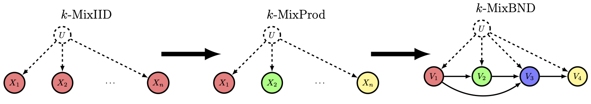

Consider the following discrete mixture models with mixture-source variable $U \in \{0, \ldots, k\}$:

1. The **$k$-MixIID** problem handles a discrete mixture in which we are allowed to sample a single variables *multiple times* without re-sampling $U$. Alternatively, we can think of this as multiple i.i.d. samples of the within-source (constant $U$) distribution. This is sometimes called the $k$-coin problem because it corresponds to selecting a random biased coin and flipping it multiple times (and then repeating this process with another randomly selected coin).
2. The **$k$-MixProd** problem handles a discrete mixture with random variables that are independent from one another within each source (when conditioned on $U$). Graphically, this can be modeled as a single vertex $U$ with edges to vertices $\mathbf{X} = X_1, \ldots, X_n$ with no edges within $\mathbf{X}$.
3. The **$k$-MixBND** problem relaxes the independence assumption, allowing for an arbitrary dependence structure among the vertices, modeled by a Bayesian Netork DAG $\mathcal{G} = (\mathbf{V}, \mathbf{E})$.

The **$k$-MixBND** problem is fundamental to causal inference, where $U$ models an unobserved confounding effect of multiple populations, obscuring the causal relationships in the observable DAG $\mathcal{G}$. By solving the mixture problem and recovering the joint probability distribution on $\mathbf{V}, U$, graphically unidentifiable causal relationships become identifiable. We have developed the first algorithm to learn mixtures of non-empty DAGs. The algorithm involves a two-step reduction from $k$-MixIID $\rightarrow$ $k$-MixProd $\rightarrow$ $k$-MixBND.

We have contributed to complexity improvements on all three steps of this reduction. We have also contributed the first known algorithm for identifying causal structure in the mixture setting.